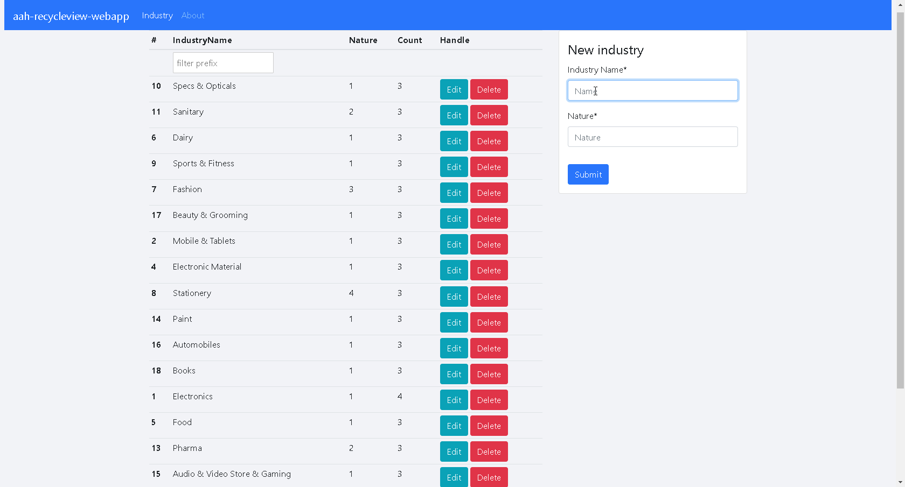

# aah-recycleview-webapp

This is a frontend web app for [aah-recycleview-backend](https://github.com/vulcangz/aah-recycleview-backend). It lives at https://github.com/sveltejs/template.

The code was written for [this articles]
- [用 Svelte 为 Go aah 后端写个 web app](https://www.worldlink.com.cn/post/write-a-web-app-for-go-aah-backend-with-svelte.html).
- [用 Go 微框架 aah 为 android app 写个 REST API 服务](https://www.worldlink.com.cn/post/write-a-rest-api-service-for-android-app-with-go-micro-framework-aah.html).

## Screenshots



## Get started

### Install aah backend

```bash
git clone git@github.com:vulcangz/aah-recycleview-backend.git
cd aah-recycleview-backend
aah run
```

After the server starts normally, accessing http://localhost/ in the browser displays `{"message": "Welcome to aah framework - API application"}`

Visit http://localhost/v1/industry to list json data for all industries entries. Visit http://localhost/v1/industry/1 to display json data for the 1st industries entry, and so on.

### Install Svelte web app frontend

Clone source code and install the dependencies...

```bash
git clone git@github.com:vulcangz/aah-recycleview-webapp.git
cd aah-recycleview-webapp
npm install
```

...then start [Rollup](https://rollupjs.org):

```bash
npm run dev
```

Navigate to [localhost:5000](http://localhost:5000). You should see your app running. Edit a component file in `src`, save it, and reload the page to see your changes.

By default, the server will only respond to requests from localhost. To allow connections from other computers, edit the `sirv` commands in package.json to include the option `--host 0.0.0.0`.

## Building and running in production mode

To create an optimised version of the app:

```bash
npm run build
```

You can run the newly built app with `npm run start`. This uses [sirv](https://github.com/lukeed/sirv), which is included in your package.json's `dependencies` so that the app will work when you deploy to platforms like [Heroku](https://heroku.com).

## Single-page app mode

By default, sirv will only respond to requests that match files in `public`. This is to maximise compatibility with static fileservers, allowing you to deploy your app anywhere.

If you're building a single-page app (SPA) with multiple routes, sirv needs to be able to respond to requests for _any_ path. You can make it so by editing the `"start"` command in package.json:

```js
"start": "sirv public --single"
```

## Credits and Inspiration

* [Svelte framework](https://svelte.dev/)
* [svelte-spa-router](https://github.com/ItalyPaleAle/svelte-spa-router)
* [UI building with Bootstrap](https://getbootstrap.com/)
